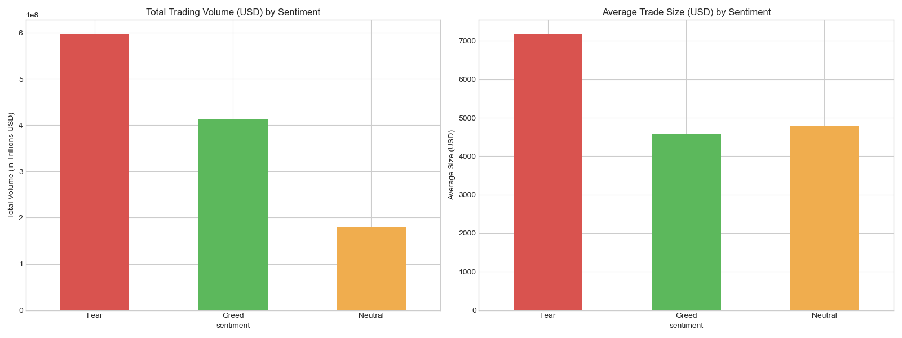
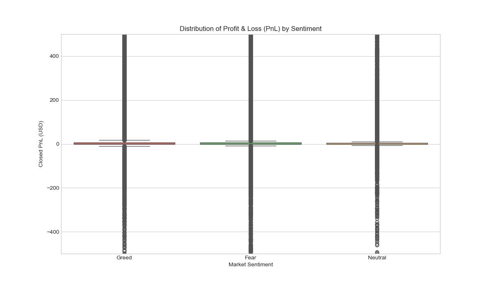
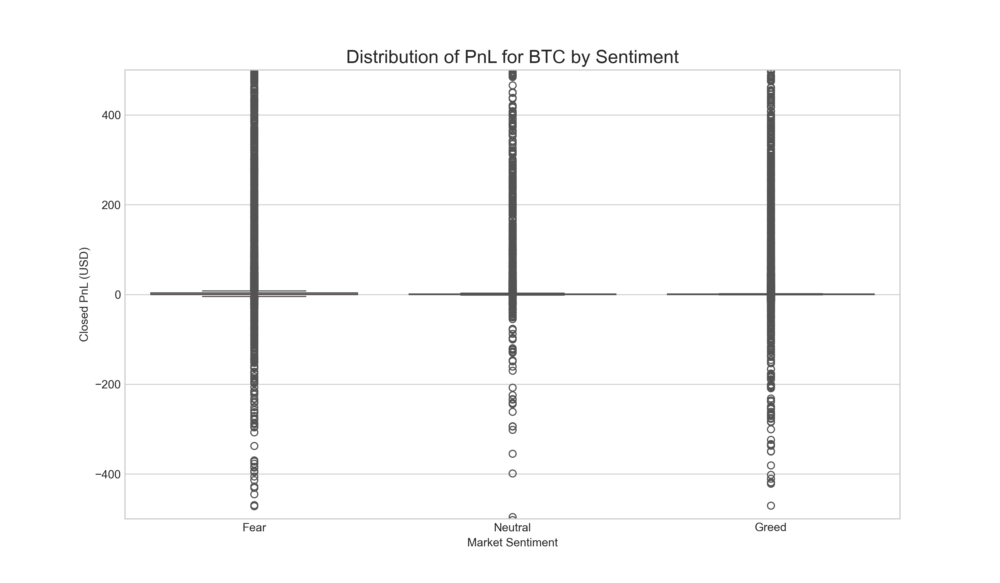
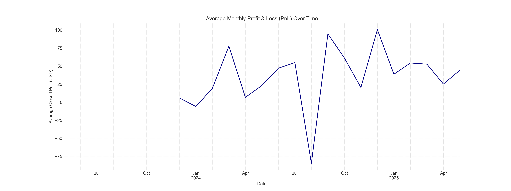
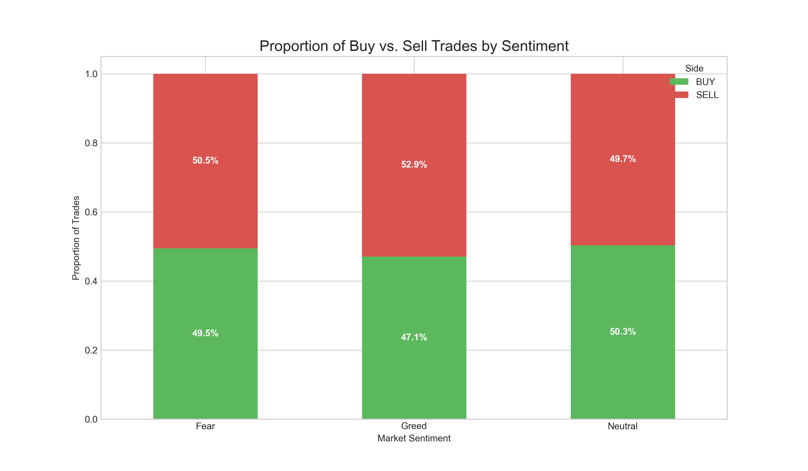

# Trader Behavior vs. Market Sentiment Analysis

## 📊 Project Overview

[cite_start]This project explores and analyzes the relationship between trader behavior and market sentiment[cite: 31]. [cite_start]The analysis uses historical trader data from Hyperliquid and the Bitcoin Fear & Greed Index[cite: 31, 33, 35]. [cite_start]The primary objective is to understand how trading metrics—such as profitability, volume, and risk—align or diverge from the prevailing market sentiment of fear versus greed[cite: 38]. [cite_start]The insights are intended to help identify underlying trends that could inform the development of smarter trading strategies[cite: 39].

---

## 💾 Datasets Used

Two primary datasets were utilized for this analysis:

1.  [cite_start]**Historical Trader Data from Hyperliquid** [cite: 35][cite_start]: A detailed log of trades containing columns such as `account`, `execution price`, `size`, `side`, `time`, and `closedPnL`[cite: 36].
2.  [cite_start]**Bitcoin Market Sentiment Dataset** [cite: 33][cite_start]: This dataset provides daily market sentiment, with key columns including `Date` and `Classification` (e.g., Fear / Greed)[cite: 34].

---

## 🛠️ Methodology

The analysis was performed using a Jupyter Notebook (`notebook_1.ipynb`) with Python libraries such as Pandas, Matplotlib, and Seaborn. The process involved the following key steps:

1.  **Data Loading and Inspection**: The two raw CSV files, `historical_data.csv` and `fear_greed_index.csv`, were loaded into Pandas DataFrames. An initial inspection was conducted to check for null values, review data types, and generate descriptive statistics for both datasets.

2.  **Data Cleaning and Preprocessing**:
    * The trader data was cleaned by converting the `Timestamp IST` column to a datetime format and dropping columns irrelevant to the analysis.
    * The sentiment data's classifications were simplified by grouping 'Extreme Fear' into **Fear** and 'Extreme Greed' into **Greed**.
    * The two DataFrames were merged on a common `date` column. The few resulting rows with missing sentiment data were subsequently dropped.

3.  **Exploratory Data Analysis (EDA)**: The cleaned and merged dataset was analyzed to uncover relationships between market sentiment and various trading metrics. This included grouping data by sentiment to compare trading volume, profitability (PnL), and buy vs. sell behavior. The findings were visualized using bar charts and box plots.

---

## 📈 Key Findings & Insights

### Trading Volume vs. Sentiment

The analysis shows that traders are most active during periods of market fear.

* **Total Trading Volume**: The highest total trading volume occurred during **Fear** periods, amounting to over $597 million. This is significantly greater than the volume during **Greed** ($413 million) and **Neutral** ($180 million) periods.
* **Average Trade Size**: The average trade size was also largest during periods of **Fear** ($7,182). This indicates that traders not only trade more frequently but also execute larger trades when the market is fearful.

*Source: Generated from `notebook_1.ipynb`*

### Profitability (PnL) vs. Sentiment

While volume peaks in fear, profitability patterns show more complexity.

* **Overall PnL Distribution**: Across all assets, traders achieved the highest average profits during periods of **Greed** (mean PnL of $53.88), followed closely by **Fear** ($49.21). Neutral periods were the least profitable on average. The PnL distribution is characterized by significant outliers, suggesting that while median profits are modest, extreme gains and losses are possible across all sentiment conditions.
* **BTC-Specific PnL Distribution**: For **BTC** trades, the trend is different. The highest average PnL was recorded during **Fear** ($41.75). This suggests that heightened volatility in BTC during fearful periods may offer more profitable opportunities than periods of greed.
* **Average Monthly PnL**: The average PnL fluctuates significantly month-to-month but has remained generally positive over the observed timeframe.

| PnL Distribution (All Assets) | PnL Distribution (BTC) | Average Monthly PnL |
| :---: | :---: | :---: |
|  |  |  |

### Trader Behavior: Buy vs. Sell Ratio

There is a discernible shift in aggregate trader behavior corresponding with market sentiment.

* In **Greed** periods, there is a higher proportion of **SELL** trades (52.9%). This may indicate profit-taking behavior when the market is optimistic.
* In **Fear** periods, the buy/sell ratio is nearly balanced, with a slight tendency towards **SELL** trades (50.5%).
* **Neutral** periods show a minor inclination towards **BUY** trades (50.3%).

*Source: Generated from `notebook_1.ipynb`*

---

## 📁 Project File Structure

[cite_start]The project follows the standardized submission format as required[cite: 3, 4].

ds_gyangupta/
├── 📓 notebook_1.ipynb       # Main analysis notebook.
├── 📄 ds_report.pdf          # Final summary of insights.
├── 📄 README.md              # This project documentation.
├── 📁 csv_files/
│   └── 📜 *.csv              # Source data files.
└── 📁 outputs/
    └── 🖼️ *.png              # All visual outputs and charts.

---

## 🚀 How to Run the Analysis

1.  **Prerequisites**: Ensure you have a Python environment with the following libraries installed: `pandas`, `numpy`, `matplotlib`, and `seaborn`.
2.  **File Placement**: Place the provided CSV files (`historical_data.csv` and `fear_greed_index.csv`) inside the `csv_files/` directory[cite: 15].
3.  **Execute Notebook**: Open and run the `notebook_1.ipynb` file in a Jupyter environment like Google Colab[cite: 10]. The notebook will process the data and generate all analytical outputs and visualizations in the `outputs/` folder[cite: 17].
